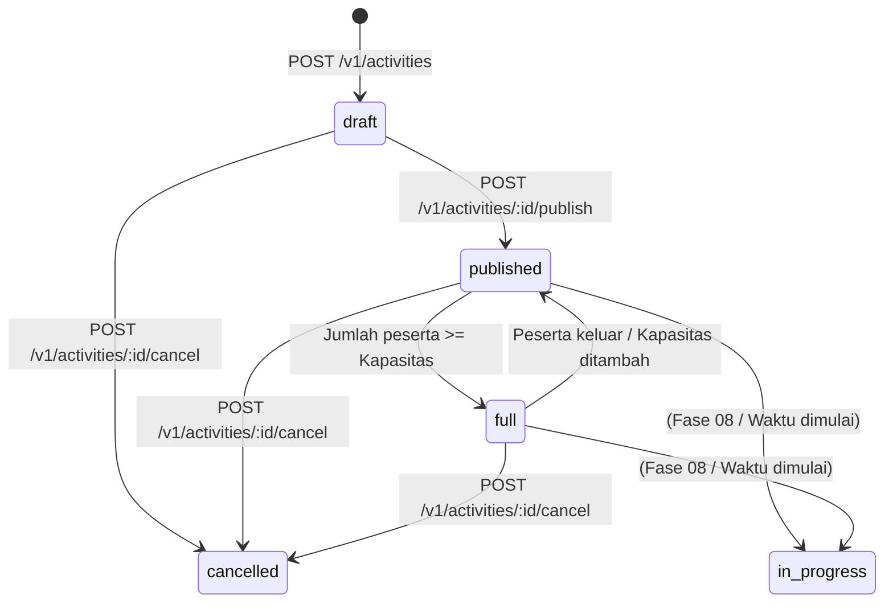

# Fase 06: Invitation & Participation (Spesifikasi & Dokumentasi)

Dokumen ini menjelaskan arsitektur, state machine, model data, transaksi database, dan antarmuka untuk alur **Buat Ajakan (Invitation)** dan **Partisipasi (Participation)** pada platform `placetogo.id`.

---

## 1. State Machine & Siklus Hidup Ajakan

Ajakan (`activities/{id}`) memiliki status siklus hidup sebagai berikut:

### Aturan Status
- **`draft`**: Dibuat pertama kali oleh pembuat ajakan. Hanya dapat dilihat dan diubah oleh pembuatnya. Tidak muncul di Discovery / pencarian publik.
- **`published`**: Telah dipublikasikan dan aktif menerima peserta baru. Muncul di tab Discovery (Terbaru, Populer, Terdekat).
- **`full`**: Kuota peserta (`participantCount`) telah mencapai atau melebihi `capacity`. Tetap muncul di Discovery dengan tanda penuh, namun tombol "Gabung" dinonaktifkan.
- **`cancelled`**: Dibatalkan oleh pembuat ajakan. Tidak menerima peserta baru dan tidak dapat diubah lagi.

---

## 2. Partisipasi Langsung (Direct Join) & Transaksi Atomik

Untuk memenuhi kriteria konkurensi tinggi dan mencegah kondisi balapan (*race condition / overbooking*), proses bergabung (`join`) dan keluar (`leave`) dirancang dengan prinsip:

1. **Direct Join**: Pengguna yang menekan tombol "Gabung" langsung didaftarkan tanpa perlu menunggu persetujuan manual creator.
2. **Transaksi Atomik Firestore**:
   - Backend membaca dokumen aktivitas dan memeriksa status (`published`), waktu (`startsAt > now`), kapasitas (`participantCount < capacity`), dan memastikan pengguna bukan creator serta belum terdaftar.
   - Dokumen `activities/{id}/participants/{uid}` ditulis dengan `{ joinedAt: serverTimestamp }`.
   - Dokumen `activities/{id}/join_requests/{uid}` ditulis dengan `{ status: 'approved', createdAt, reviewedAt }` sebagai catatan audit idempoten.
   - Field `participantCount` dinaikkan secara inkremental (+1). Jika `participantCount >= capacity`, status dokumen aktivitas otomatis dialihkan menjadi `'full'`.

### Alur Keluar (Leave)
- Pengguna yang membatalkan keikutsertaannya akan menghapus dokumen `participants/{uid}` dan memperbarui `join_requests/{uid}` menjadi `{ status: 'left', reviewedAt }`.
- `participantCount` diturunkan (-1). Jika sebelumnya berstatus `'full'`, status otomatis kembali menjadi `'published'`.

---

## 3. Kontrak REST API

Semua rute aktivitas memerlukan header otorisasi Bearer token Firebase dan pengguna yang telah memverifikasi email serta melengkapi profil (`stage: ready`).

| Method | Endpoint | Fungsi | Payload / Respon |
|---|---|---|---|
| `POST` | `/v1/activities` | Membuat draf ajakan baru | Body: `CreateActivityInput` Respon: `201 Created` (`ActivityDoc` status `draft`) |
| `POST` | `/v1/activities/:id/publish` | Mempublikasikan ajakan | Respon: `200 OK` (`ActivityDoc` status `published`) |
| `POST` | `/v1/activities/:id/cancel` | Membatalkan ajakan (hanya pembuat) | Respon: `200 OK` (`ActivityDoc` status `cancelled`) |
| `PATCH` | `/v1/activities/:id/capacity` | Mengubah kapasitas kuota | Body: `{ capacity: number }` Respon: `200 OK` (`ActivityDoc`) |
| `POST` | `/v1/activities/:id/join-requests` | Bergabung ke ajakan | Respon: `200 OK` (`ActivityDoc`) |
| `DELETE` | `/v1/activities/:id/join-requests/me` | Keluar dari ajakan | Respon: `200 OK` (`ActivityDoc`) |

### Kode Kesalahan (Error Codes)
- `400 self_join`: Pembuat tidak dapat bergabung ke ajakannya sendiri.
- `400 capacity_below_participants`: Kapasitas baru tidak boleh lebih kecil dari jumlah peserta yang sudah terdaftar.
- `403 forbidden`: Aksi tidak diizinkan (misal mengubah ajakan orang lain).
- `404 activity_not_found`: Dokumen ajakan tidak ditemukan.
- `404 not_joined`: Pengguna belum terdaftar di ajakan saat mencoba keluar.
- `409 already_joined`: Pengguna sudah terdaftar sebelumnya.
- `409 activity_full`: Kapasitas ajakan sudah penuh saat transaksi dijalankan.
- `409 already_started`: Ajakan telah melewati waktu mulai `startsAt`.
- `409 invalid_state`: Status ajakan tidak mengizinkan operasi (misal mempublikasikan ajakan yang sudah dibatalkan).

---

## 4. Antarmuka Pengguna (Web Frontend)

1. **Halaman Buat Ajakan (`/buat`)**:
   - Pemilihan kategori aktivitas dengan grid ikon visual interaktif.
   - Pilihan kota dan integrasi `PlacePicker` (Google Places autocomplete) dengan fallback manual.
   - Validasi waktu di masa depan (`startsAt > Date.now()`).
   - Stepper kapasitas intuitif (+/-) dengan batas aman 1–50 orang.
   - Pemilihan skema biaya (`Patungan`, `Ditraktir`, `Hadiah`).
2. **Halaman Detail Ajakan (`/jelajah/[id]`)**:
   - Menampilkan status ajakan (`published`, `full`, `cancelled`).
   - Integrasi kartu aksi kontekstual (`ActivityActions`):
     - **Tamu / Belum Login**: Tombol ajakan untuk masuk.
     - **Pembuat**: Kontrol untuk mengubah kapasitas peserta dan opsi batalkan ajakan dengan modal konfirmasi.
     - **Peserta**: Indikator terdaftar dan tombol keluar dari ajakan.
     - **Pengguna Lain**: Tombol gabung dinamis dengan indikator sisa slot kuota.
